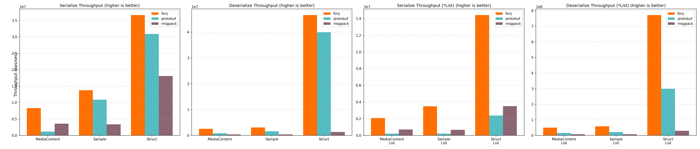
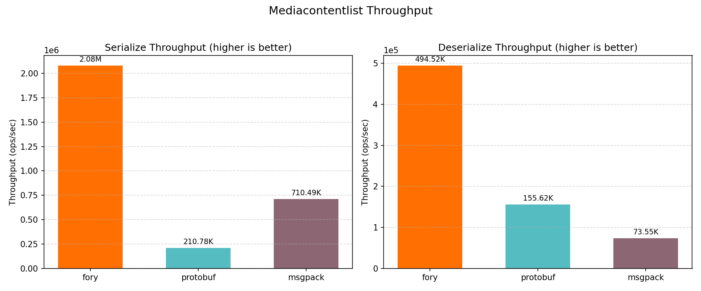
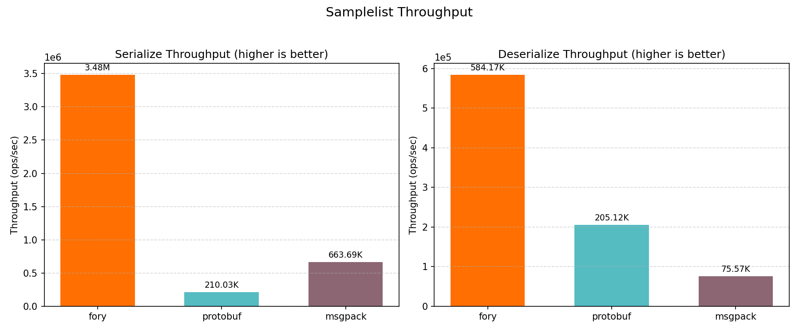

# C++ Benchmark Performance Report

_Generated on 2026-02-19 10:20:08_

## How to Generate This Report

```bash
cd benchmarks/cpp_benchmark/build
./fory_benchmark --benchmark_format=json --benchmark_out=benchmark_results.json
cd ..
python benchmark_report.py --json-file build/benchmark_results.json --output-dir report
```

## Hardware & OS Info

| Key                        | Value                     |
| -------------------------- | ------------------------- |
| OS                         | Darwin 24.6.0             |
| Machine                    | arm64                     |
| Processor                  | arm                       |
| CPU Cores (Physical)       | 12                        |
| CPU Cores (Logical)        | 12                        |
| Total RAM (GB)             | 48.0                      |
| Benchmark Date             | 2026-02-19T10:19:31+08:00 |
| CPU Cores (from benchmark) | 12                        |

## Benchmark Plots

All class-level plots below show throughput (ops/sec).

### Throughput

<p align="center">

</p>

### Mediacontent

<p align="center">

</p>

### Mediacontentlist

<p align="center">

</p>

### Sample

<p align="center">

</p>

### Samplelist

<p align="center">

</p>

### Struct

<p align="center">

</p>

### Structlist

<p align="center">

</p>

## Benchmark Results

### Timing Results (nanoseconds)

| Datatype         | Operation   | fory (ns) | protobuf (ns) | msgpack (ns) | Fastest |
| ---------------- | ----------- | --------- | ------------- | ------------ | ------- |
| MediaContent     | Serialize   | 120.4     | 863.8         | 281.1        | fory    |
| MediaContent     | Deserialize | 397.9     | 1197.9        | 2768.6       | fory    |
| MediaContentList | Serialize   | 480.9     | 4744.3        | 1407.5       | fory    |
| MediaContentList | Deserialize | 2022.1    | 6426.0        | 13595.9      | fory    |
| Sample           | Serialize   | 72.8      | 92.0          | 296.1        | fory    |
| Sample           | Deserialize | 328.2     | 641.2         | 2642.9       | fory    |
| SampleList       | Serialize   | 287.3     | 4761.2        | 1506.7       | fory    |
| SampleList       | Deserialize | 1711.8    | 4875.2        | 13232.0      | fory    |
| Struct           | Serialize   | 27.3      | 32.4          | 55.2         | fory    |
| Struct           | Deserialize | 21.4      | 25.0          | 747.3        | fory    |
| StructList       | Serialize   | 69.4      | 419.8         | 285.9        | fory    |
| StructList       | Deserialize | 129.4     | 334.4         | 3385.8       | fory    |

### Throughput Results (ops/sec)

| Datatype         | Operation   | fory TPS   | protobuf TPS | msgpack TPS | Fastest |
| ---------------- | ----------- | ---------- | ------------ | ----------- | ------- |
| MediaContent     | Serialize   | 8,306,128  | 1,157,712    | 3,557,700   | fory    |
| MediaContent     | Deserialize | 2,513,488  | 834,808      | 361,190     | fory    |
| MediaContentList | Serialize   | 2,079,229  | 210,777      | 710,492     | fory    |
| MediaContentList | Deserialize | 494,523    | 155,617      | 73,551      | fory    |
| Sample           | Serialize   | 13,745,041 | 10,871,787   | 3,377,292   | fory    |
| Sample           | Deserialize | 3,047,224  | 1,559,633    | 378,369     | fory    |
| SampleList       | Serialize   | 3,481,110  | 210,029      | 663,693     | fory    |
| SampleList       | Deserialize | 584,168    | 205,121      | 75,574      | fory    |
| Struct           | Serialize   | 36,672,581 | 30,900,039   | 18,114,682  | fory    |
| Struct           | Deserialize | 46,637,124 | 39,947,557   | 1,338,225   | fory    |
| StructList       | Serialize   | 14,419,548 | 2,381,886    | 3,497,903   | fory    |
| StructList       | Deserialize | 7,729,173  | 2,990,652    | 295,353     | fory    |

### Serialized Data Sizes (bytes)

| Datatype         | fory | protobuf | msgpack |
| ---------------- | ---- | -------- | ------- |
| Struct           | 58   | 61       | 55      |
| Sample           | 446  | 375      | 530     |
| MediaContent     | 365  | 301      | 480     |
| StructList       | 184  | 315      | 289     |
| SampleList       | 1980 | 1890     | 2664    |
| MediaContentList | 1535 | 1520     | 2421    |
