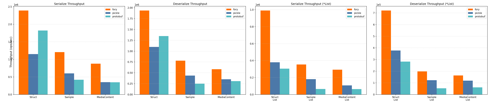

> **Note**: Different serialization frameworks excel in different scenarios. Benchmark results are for reference only.
> For your specific use case, conduct benchmarks with appropriate configurations and workloads.

## Java Benchmark

The Java benchmark section compares Fory against popular Java serialization frameworks using the current benchmark suite from `docs/benchmarks/java`.

**Serialization Throughput**:

**Deserialization Throughput**:

**Zero-Copy Serialize Throughput**:

**Zero-Copy Deserialize Throughput**:

**Important**: Fory's runtime code generation requires proper warm-up for performance measurement:

For additional benchmark notes, raw data, and the complete Java benchmark README, see [Java Benchmarks](https://github.com/apache/fory/tree/main/docs/benchmarks/java).

## Python Benchmark

Fory Python demonstrates strong performance compared to `pickle` and Protobuf across object and list workloads.

For benchmark setup, raw results, and reproduction steps, see [Python Benchmarks](../benchmarks/python/README.md).

## Rust Benchmark

Fory Rust demonstrates competitive performance compared to other Rust serialization frameworks.

Note: Results depend on hardware, dataset, and implementation versions. See the Rust guide for how to run benchmarks yourself: https://github.com/apache/fory/blob/main/benchmarks/rust_benchmark/README.md

## C++ Benchmark

Fory C++ demonstrates competitive performance compared to Protobuf C++ serialization framework.

## Go Benchmark

Fory Go demonstrates strong performance compared to Protobuf and Msgpack across
single-object and list workloads.

Note: Results depend on hardware, dataset, and implementation versions. See the
Go benchmark report for details: https://fory.apache.org/docs/benchmarks/go/

## C# Benchmark

Fory C# demonstrates strong performance compared to Protobuf and Msgpack across
typed object serialization and deserialization workloads.

Note: Results depend on hardware and runtime versions. See the C# benchmark
report for details: https://fory.apache.org/docs/benchmarks/csharp/

## Swift Benchmark

Fory Swift demonstrates strong performance compared to Protobuf and Msgpack
across both scalar-object and list workloads.

Note: Results depend on hardware and runtime versions. See the Swift benchmark
report for details: https://fory.apache.org/docs/benchmarks/swift/

## JavaScript Benchmark

Fory JavaScript demonstrates strong performance compared to Protocol Buffers and
JSON across representative Node.js workloads.

Note: Results depend on hardware, dataset, and runtime versions. See the
[JavaScript benchmark report](../benchmarks/javascript/README.md) for details.

## Dart Benchmark

Fory Dart demonstrates strong performance compared to Protocol Buffers across
representative object and list workloads.

Note: Results depend on hardware, dataset, and runtime versions. See the
[Dart benchmark report](../benchmarks/dart/README.md) for details.
