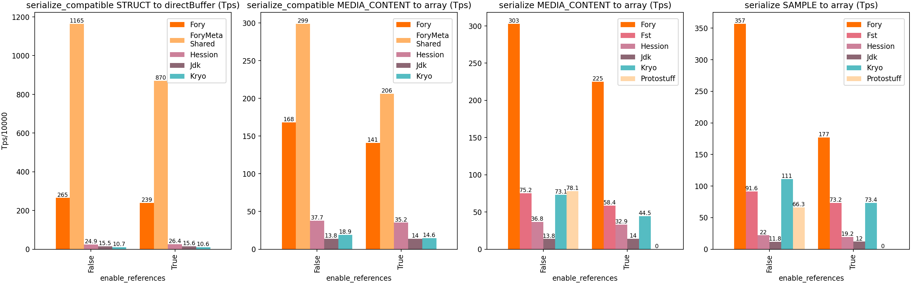
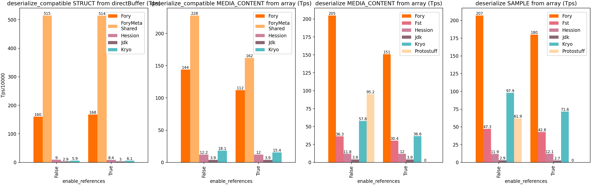

> **Note**: Different serialization frameworks excel in different scenarios. Benchmark results are for reference only.
> For your specific use case, conduct benchmarks with appropriate configurations and workloads.

## Java Benchmark

The following benchmarks compare Fory against popular Java serialization frameworks. Charts labeled **"compatible"** show schema evolution mode with forward/backward compatibility enabled, while others show schema consistent mode where class schemas must match.

**Test Classes**:

- `Struct`: Class with [100 primitive fields](https://github.com/apache/fory/tree/main/docs/benchmarks#Struct)
- `MediaContent`: Class from [jvm-serializers](https://github.com/eishay/jvm-serializers/blob/master/tpc/src/data/media/MediaContent.java)
- `Sample`: Class from [Kryo benchmark](https://github.com/EsotericSoftware/kryo/blob/master/benchmarks/src/main/java/com/esotericsoftware/kryo/benchmarks/data/Sample.java)

### Java Serialization

**Deserialization Throughput**:

**Important**: Fory's runtime code generation requires proper warm-up for performance measurement:

For additional benchmarks covering type forward/backward compatibility, off-heap support, and zero-copy serialization, see [Java Benchmarks](https://github.com/apache/fory/tree/main/docs/benchmarks).

## Rust Benchmark

Fory Rust demonstrates competitive performance compared to other Rust serialization frameworks.

Note: Results depend on hardware, dataset, and implementation versions. See the Rust guide for how to run benchmarks yourself: https://github.com/apache/fory/blob/main/benchmarks/rust_benchmark/README.md

## C++ Benchmark

Fory C++ demonstrates competitive performance compared to Protobuf C++ serialization framework.

## Go Benchmark

Fory Go demonstrates strong performance compared to Protobuf and Msgpack across
single-object and list workloads.

Note: Results depend on hardware, dataset, and implementation versions. See the
Go benchmark report for details: https://fory.apache.org/docs/benchmarks/go/

## Python Benchmark

Fory Python demonstrates strong performance compared to `pickle` and Protobuf
across single-object and list workloads.

Note: Results depend on hardware, dataset, Python runtime, and implementation
versions. See the Python benchmark report for details:
https://fory.apache.org/docs/benchmarks/python/

## C# Benchmark

Fory C# demonstrates strong performance compared to Protobuf and Msgpack across
typed object serialization and deserialization workloads.

Note: Results depend on hardware and runtime versions. See the C# benchmark
report for details: https://fory.apache.org/docs/benchmarks/csharp/

## Swift Benchmark

Fory Swift demonstrates strong performance compared to Protobuf and Msgpack
across both scalar-object and list workloads.

Note: Results depend on hardware and runtime versions. See the Swift benchmark
report for details: https://fory.apache.org/docs/benchmarks/swift/

## JavaScript Benchmark

The data used for this bar graph includes a complex object that has many kinds of field types, and the size of the JSON data is 3KB.

See [benchmarks](https://github.com/apache/fory/blob/main/javascript/benchmark/index.js) for the benchmark code.
