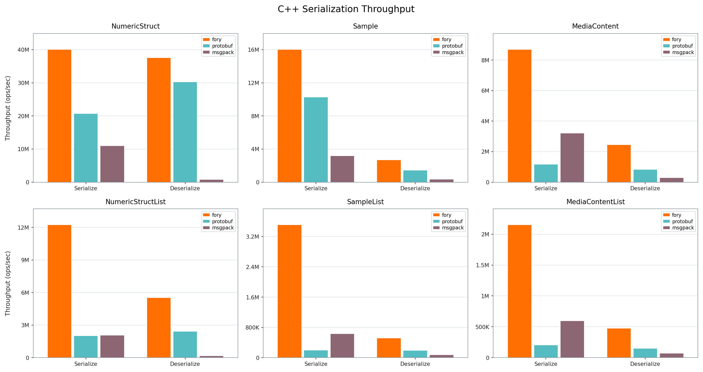

# C++ 基准性能报告

_生成于 2026-05-08 17:54:45_

## 如何生成本报告

```bash
cd benchmarks/cpp/build
./fory_benchmark --benchmark_format=json --benchmark_out=benchmark_results.json
cd ..
python benchmark_report.py --json-file build/benchmark_results.json --output-dir report
```

## 基准图表

图表展示吞吐量（ops/sec）；数值越高越好。



## 硬件与操作系统信息

| 键                        | 值                     |
| -------------------------- | ------------------------- |
| 操作系统                         | Darwin 24.6.0             |
| 机器架构                    | arm64                     |
| 处理器                  | arm                       |
| CPU 核心数（物理）       | 12                        |
| CPU 核心数（逻辑）        | 12                        |
| 总内存（GB）             | 48.0                      |
| 基准日期             | 2026-05-08T16:29:28+08:00 |
| CPU 核心数（基准采集） | 12                        |

## 基准结果

### 延迟结果（纳秒）

| 数据类型          | 操作   | fory (ns) | protobuf (ns) | msgpack (ns) | 最快 |
| ----------------- | ---- | --------- | ------------- | ------------ | ------- |
| NumericStruct     | 序列化   | 24.9      | 48.2          | 91.0         | fory    |
| NumericStruct     | 反序列化 | 26.6      | 33.0          | 1194.5       | fory    |
| Sample            | 序列化   | 62.3      | 97.3          | 314.6        | fory    |
| Sample            | 反序列化 | 371.1     | 689.0         | 2649.9       | fory    |
| MediaContent      | 序列化   | 115.0     | 857.2         | 311.7        | fory    |
| MediaContent      | 反序列化 | 406.5     | 1193.1        | 3311.1       | fory    |
| NumericStructList | 序列化   | 81.7      | 495.0         | 485.6        | fory    |
| NumericStructList | 反序列化 | 180.9     | 410.6         | 5733.1       | fory    |
| SampleList        | 序列化   | 284.9     | 5004.9        | 1579.6       | fory    |
| SampleList        | 反序列化 | 1928.7    | 5118.1        | 13396.8      | fory    |
| MediaContentList  | 序列化   | 464.8     | 4861.1        | 1671.1       | fory    |
| MediaContentList  | 反序列化 | 2099.8    | 6610.3        | 13963.4      | fory    |

### 吞吐结果（ops/sec）

| 数据类型          | 操作   | fory TPS   | protobuf TPS | msgpack TPS | 最快 |
| ----------------- | ---- | ---------- | ------------ | ---- | ------- |
| NumericStruct     | 序列化   | 40,087,668 | 20,733,305   | 10,989,907  | fory    |
| NumericStruct     | 反序列化 | 37,606,127 | 30,296,744   | 837,189     | fory    |
| Sample            | 序列化   | 16,041,299 | 10,277,207   | 3,178,983   | fory    |
| Sample            | 反序列化 | 2,694,434  | 1,451,449    | 377,373     | fory    |
| MediaContent      | 序列化   | 8,698,574  | 1,166,539    | 3,208,626   | fory    |
| MediaContent      | 反序列化 | 2,460,094  | 838,185      | 302,013     | fory    |
| NumericStructList | 序列化   | 12,240,275 | 2,020,102    | 2,059,276   | fory    |
| NumericStructList | 反序列化 | 5,527,333  | 2,435,246    | 174,427     | fory    |
| SampleList        | 序列化   | 3,510,210  | 199,804      | 633,061     | fory    |
| SampleList        | 反序列化 | 518,490    | 195,386      | 74,645      | fory    |
| MediaContentList  | 序列化   | 2,151,560  | 205,715      | 598,396     | fory    |
| MediaContentList  | 反序列化 | 476,241    | 151,280      | 71,616      | fory    |

### 序列化数据大小（字节）

| 数据类型          | fory | protobuf | msgpack |
| ----------------- | ---- | -------- | ------- |
| NumericStruct     | 78   | 93       | 87      |
| Sample            | 445  | 375      | 530     |
| MediaContent      | 362  | 301      | 480     |
| NumericStructList | 255  | 475      | 449     |
| SampleList        | 1978 | 1890     | 2664    |
| MediaContentList  | 1531 | 1520     | 2421    |
