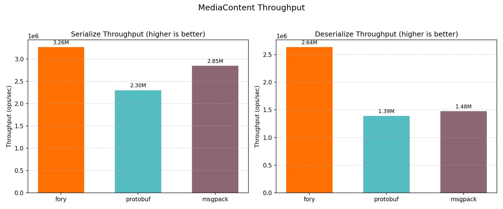
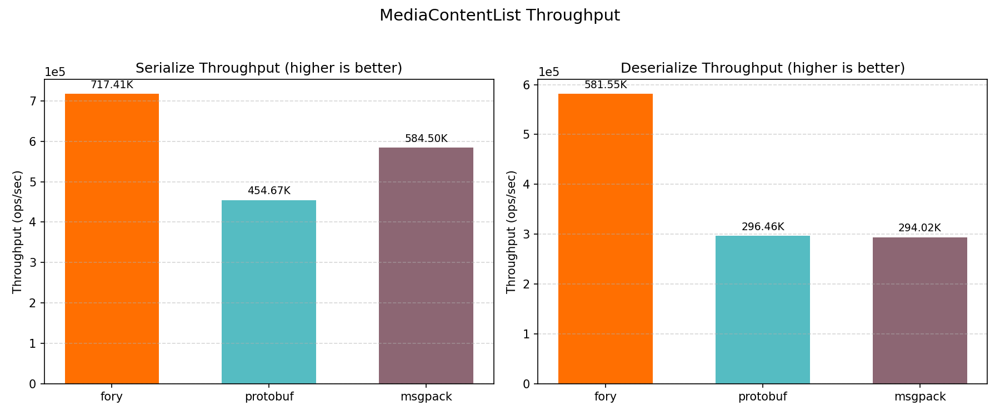
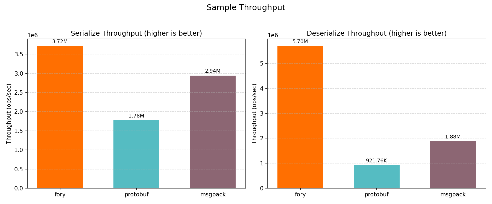
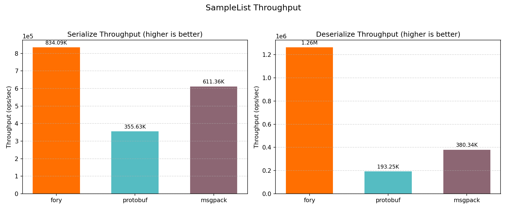
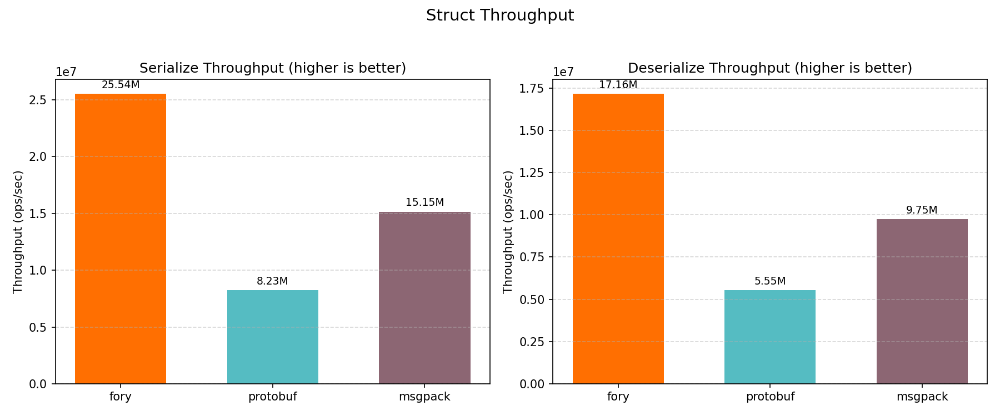
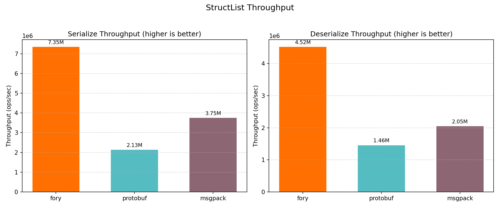

# C# 基准性能报告

_生成于 2026-03-11 02:14:01_

## 如何生成本报告

```bash
cd benchmarks/csharp
dotnet run -c Release --project ./Fory.CSharpBenchmark.csproj -- --output build/benchmark_results.json
python3 benchmark_report.py --json-file build/benchmark_results.json --output-dir report
```

## 硬件与操作系统信息

| 键                                 | 值                                                                                                                           |
| ---------------------------------- | ---------------------------------------------------------------------------------------------------------------------------- |
| 操作系统                           | Darwin 24.6.0 Darwin Kernel Version 24.6.0: Wed Oct 15 21:12:15 PDT 2025; root:xnu-11417.140.69.703.14~1/RELEASE_ARM64_T6041 |
| 系统架构                           | Arm64                                                                                                                        |
| 机器架构                           | Arm64                                                                                                                        |
| 运行时版本                         | 8.0.24                                                                                                                       |
| 基准日期（UTC）                    | 2026-03-10T18:14:00.0852460Z                                                                                                 |
| 预热秒数                           | 1                                                                                                                            |
| 持续秒数                           | 3                                                                                                                            |
| CPU 逻辑核心数（基准采集）         | 12                                                                                                                           |
| CPU 核心数（物理）                 | 12                                                                                                                           |
| CPU 核心数（逻辑）                 | 12                                                                                                                           |
| 总内存（GB）                       | 48.0                                                                                                                         |

## 基准覆盖范围

| 键                  | 值                                                                     |
| ------------------- | ---------------------------------------------------------------------- |
| 输入 JSON 中的用例  | 36 / 36                                                                |
| 序列化器            | fory, msgpack, protobuf                                                |
| 数据类型            | struct, sample, mediacontent, structlist, samplelist, mediacontentlist |
| 操作                | serialize, deserialize                                                 |

## 基准图表

下列各类图表均展示吞吐量（ops/sec）。

### 总吞吐量

<p align="center">

</p>

### `MediaContent` 基准

<p align="center">

</p>

### `MediaContentList` 基准

<p align="center">

</p>

### Sample

<p align="center">

</p>

### Samplelist

<p align="center">

</p>

### Struct

<p align="center">

</p>

### Structlist

<p align="center">

</p>

## 基准结果

### 延迟结果（纳秒）

| 数据类型         | 操作        | fory (ns) | protobuf (ns) | msgpack (ns) | 最快    |
| ---------------- | ----------- | --------- | ------------- | ------------ | ------- |
| Struct           | Serialize   | 39.2      | 121.5         | 66.0         | fory    |
| Struct           | Deserialize | 58.3      | 180.1         | 102.6        | fory    |
| Sample           | Serialize   | 269.2     | 562.6         | 339.6        | fory    |
| Sample           | Deserialize | 175.6     | 1084.9        | 531.8        | fory    |
| MediaContent     | Serialize   | 306.3     | 434.7         | 351.5        | fory    |
| MediaContent     | Deserialize | 379.4     | 718.8         | 676.9        | fory    |
| StructList       | Serialize   | 136.1     | 468.5         | 266.9        | fory    |
| StructList       | Deserialize | 221.1     | 687.0         | 488.5        | fory    |
| SampleList       | Serialize   | 1198.9    | 2811.9        | 1635.7       | fory    |
| SampleList       | Deserialize | 791.5     | 5174.5        | 2629.2       | fory    |
| MediaContentList | Serialize   | 1393.9    | 2199.4        | 1710.9       | fory    |
| MediaContentList | Deserialize | 1719.5    | 3373.1        | 3401.2       | fory    |

### 吞吐结果（ops/sec）

| 数据类型         | 操作        | fory TPS   | protobuf TPS | msgpack TPS | 最快    |
| ---------------- | ----------- | ---------- | ------------ | ----------- | ------- |
| Struct           | Serialize   | 25,535,535 | 8,233,006    | 15,153,903  | fory    |
| Struct           | Deserialize | 17,164,793 | 5,553,220    | 9,745,096   | fory    |
| Sample           | Serialize   | 3,715,302  | 1,777,405    | 2,944,981   | fory    |
| Sample           | Deserialize | 5,696,108  | 921,760      | 1,880,420   | fory    |
| MediaContent     | Serialize   | 3,264,890  | 2,300,297    | 2,845,038   | fory    |
| MediaContent     | Deserialize | 2,635,449  | 1,391,138    | 1,477,346   | fory    |
| StructList       | Serialize   | 7,347,503  | 2,134,576    | 3,746,866   | fory    |
| StructList       | Deserialize | 4,522,114  | 1,455,557    | 2,046,988   | fory    |
| SampleList       | Serialize   | 834,086    | 355,633      | 611,365     | fory    |
| SampleList       | Deserialize | 1,263,450  | 193,254      | 380,338     | fory    |
| MediaContentList | Serialize   | 717,408    | 454,670      | 584,497     | fory    |
| MediaContentList | Deserialize | 581,554    | 296,459      | 294,015     | fory    |

### 序列化数据大小（字节）

| 数据类型         | fory | protobuf | msgpack |
| ---------------- | ---- | -------- | ------- |
| Struct           | 58   | 61       | 55      |
| Sample           | 446  | 460      | 562     |
| MediaContent     | 365  | 307      | 479     |
| StructList       | 184  | 315      | 284     |
| SampleList       | 1980 | 2315     | 2819    |
| MediaContentList | 1535 | 1550     | 2404    |
