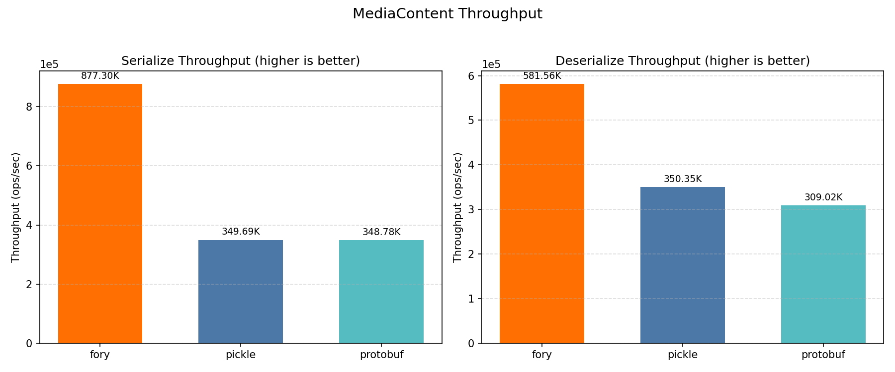
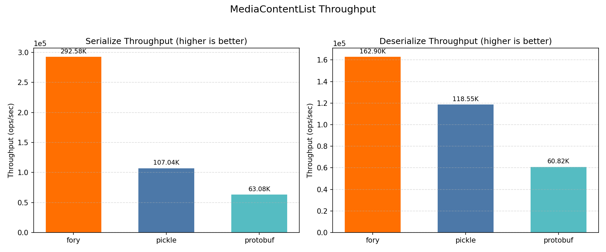
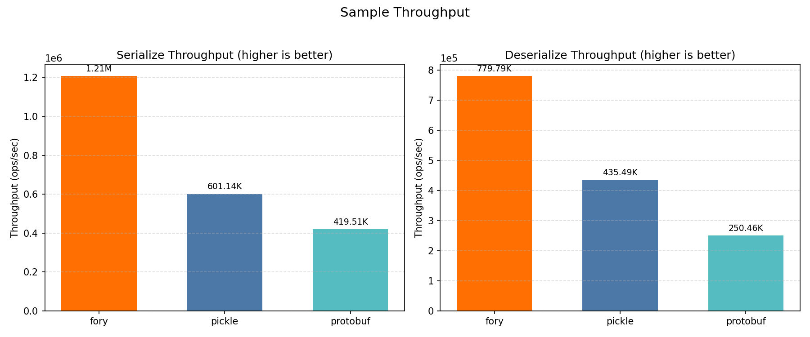
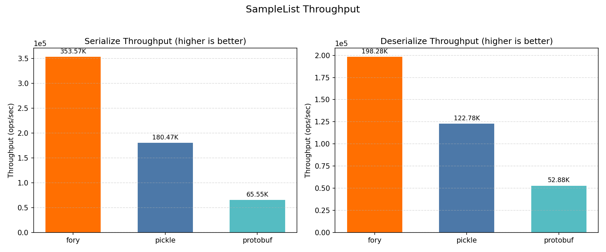
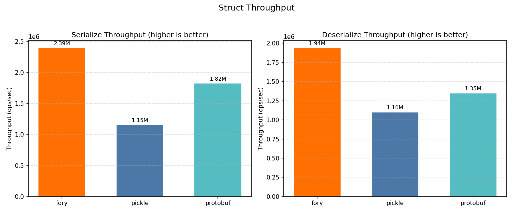
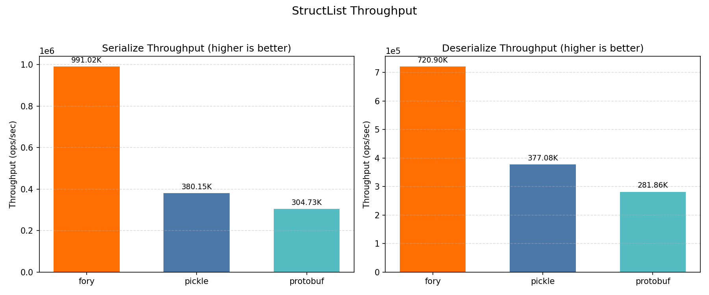

# Python 基准性能报告

_生成于 2026-04-14 14:53:18_

## 如何生成本报告

```bash
cd benchmarks/python
./run.sh
```

## 硬件与操作系统信息

| 键                    | 值                           |
| --------------------- | ---------------------------- |
| 操作系统              | Darwin 24.6.0                |
| 机器架构              | arm64                        |
| 处理器                | arm                          |
| Python                | 3.10.8                       |
| CPU 核心数（物理）    | 12                           |
| CPU 核心数（逻辑）    | 12                           |
| 总内存（GB）          | 48.0                         |
| Python 实现           | CPython                      |
| 基准平台              | macOS-15.7.2-arm64-arm-64bit |

## 基准配置

| 键         | 值    |
| ---------- | ----- |
| warmup     | 3     |
| iterations | 15    |
| repeat     | 5     |
| number     | 1000  |
| list_size  | 5     |

## 基准图表

所有图表均展示吞吐量（ops/sec）；数值越高越好。

### 总吞吐量


### Mediacontent



### Mediacontentlist



### Sample



### Samplelist



### Struct



### Structlist



## 基准结果

### 延迟结果（纳秒）

| 数据类型         | 操作        | fory (ns) | pickle (ns) | protobuf (ns) | 最快     |
| ---------------- | ----------- | --------- | ----------- | ------------- | -------- |
| Struct           | Serialize   | 431.3     | 963.9       | 604.3         | fory     |
| Struct           | Deserialize | 476.6     | 925.1       | 804.8         | fory     |
| Sample           | Serialize   | 4966.3    | 12725.1     | 4396.0        | protobuf |
| Sample           | Deserialize | 4362.9    | 6409.2      | 6620.1        | fory     |
| MediaContent     | Serialize   | 1213.1    | 4263.1      | 3173.7        | fory     |
| MediaContent     | Deserialize | 1620.7    | 4625.8      | 4306.3        | fory     |
| StructList       | Serialize   | 1072.0    | 2798.6      | 3759.0        | fory     |
| StructList       | Deserialize | 1334.7    | 2756.7      | 3963.5        | fory     |
| SampleList       | Serialize   | 23866.8   | 33484.5     | 18711.7       | protobuf |
| SampleList       | Deserialize | 17347.5   | 22999.0     | 36077.1       | fory     |
| MediaContentList | Serialize   | 3526.9    | 11258.1     | 17670.6       | fory     |
| MediaContentList | Deserialize | 6241.1    | 10209.5     | 21440.7       | fory     |

### 吞吐结果（ops/sec）

| 数据类型         | 操作        | fory TPS  | pickle TPS | protobuf TPS | 最快     |
| ---------------- | ----------- | --------- | ---------- | ------------ | -------- |
| Struct           | Serialize   | 2,318,598 | 1,037,429  | 1,654,700    | fory     |
| Struct           | Deserialize | 2,098,391 | 1,081,003  | 1,242,545    | fory     |
| Sample           | Serialize   | 201,358   | 78,585     | 227,479      | protobuf |
| Sample           | Deserialize | 229,204   | 156,026    | 151,056      | fory     |
| MediaContent     | Serialize   | 824,338   | 234,569    | 315,087      | fory     |
| MediaContent     | Deserialize | 616,999   | 216,177    | 232,216      | fory     |
| StructList       | Serialize   | 932,803   | 357,322    | 266,029      | fory     |
| StructList       | Deserialize | 749,212   | 362,753    | 252,301      | fory     |
| SampleList       | Serialize   | 41,899    | 29,865     | 53,442       | protobuf |
| SampleList       | Deserialize | 57,645    | 43,480     | 27,718       | fory     |
| MediaContentList | Serialize   | 283,535   | 88,825     | 56,591       | fory     |
| MediaContentList | Deserialize | 160,227   | 97,948     | 46,640       | fory     |

### 序列化数据大小（字节）

| 数据类型         | fory | pickle | protobuf |
| ---------------- | ---- | ------ | -------- |
| Struct           | 58   | 126    | 61       |
| Sample           | 446  | 1176   | 375      |
| MediaContent     | 391  | 624    | 301      |
| StructList       | 184  | 420    | 315      |
| SampleList       | 1980 | 3546   | 1890     |
| MediaContentList | 1665 | 1415   | 1520     |
