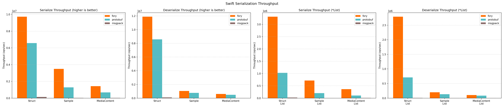

# Fory Swift 基准

该基准比较 Apache Fory、Protocol Buffers 和 JSON 在 Swift 中的序列化与反序列化吞吐量。

## 吞吐图表

## 硬件与运行时信息

| 键                   | 值                         |
| --------------------- | ----------------------------- |
| 时间戳             | 2026-05-08T09:05:32Z          |
| 操作系统                    | Version 15.7.2 (Build 24G325) |
| 主机                  | macbook-pro.local             |
| CPU 核心数（逻辑）   | 12                            |
| 内存（GB）           | 48.00                         |
| 每个用例持续时长（秒） | 3                             |

## 吞吐结果

| 数据类型          | 操作   |   Fory TPS | Protobuf TPS | JSON TPS | 最快      |
| ----------------- | ---- | ---------: | -----------: | -------: | ------------ |
| NumericStruct     | 序列化   |  9,435,623 |    6,175,939 |  408,960 | fory (1.53x) |
| NumericStruct     | 反序列化 | 11,037,225 |    6,842,676 |  328,302 | fory (1.61x) |
| Sample            | 序列化   |  3,596,835 |    1,257,100 |   79,781 | fory (2.86x) |
| Sample            | 反序列化 |    982,255 |      733,588 |   41,274 | fory (1.34x) |
| MediaContent      | 序列化   |  1,561,376 |      609,896 |   98,677 | fory (2.56x) |
| MediaContent      | 反序列化 |    523,836 |      395,202 |   70,528 | fory (1.33x) |
| NumericStructList | 序列化   |  2,910,846 |      918,363 |   82,965 | fory (3.17x) |
| NumericStructList | 反序列化 |  2,436,636 |      701,656 |   69,353 | fory (3.47x) |
| SampleList        | 序列化   |    694,557 |      202,040 |   16,679 | fory (3.44x) |
| SampleList        | 反序列化 |    187,109 |      131,947 |    8,236 | fory (1.42x) |
| MediaContentList  | 序列化   |    348,238 |       98,007 |   18,698 | fory (3.55x) |
| MediaContentList  | 反序列化 |    104,990 |       74,422 |   16,298 | fory (1.41x) |

## 序列化大小（字节）

| 数据类型          | Fory | Protobuf | JSON |
| ----------------- | ---: | -------: | ---: |
| NumericStruct     |   78 |       93 |  159 |
| Sample            |  445 |      375 |  696 |
| MediaContent      |  362 |      301 |  608 |
| NumericStructList |  255 |      475 |  816 |
| SampleList        | 1978 |     1890 | 3501 |
| MediaContentList  | 1531 |     1520 | 3067 |
