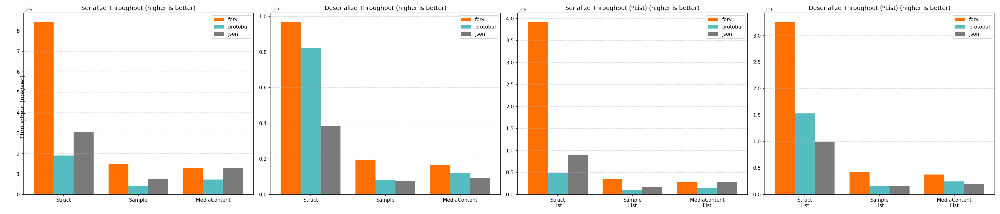
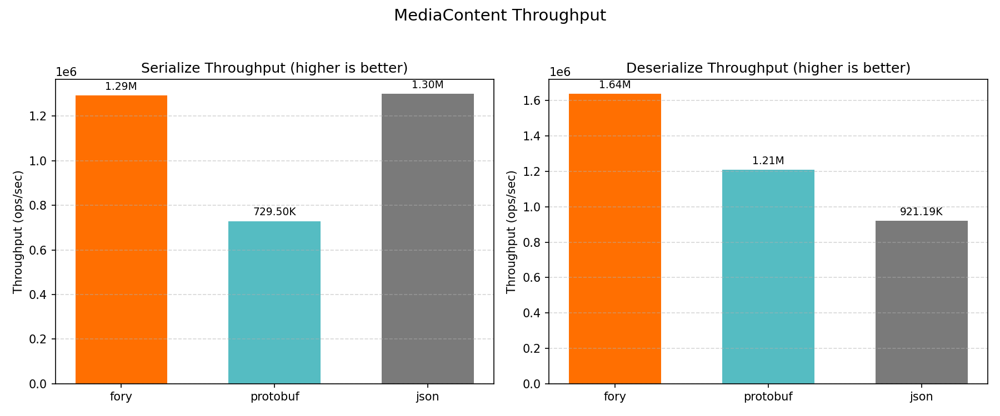
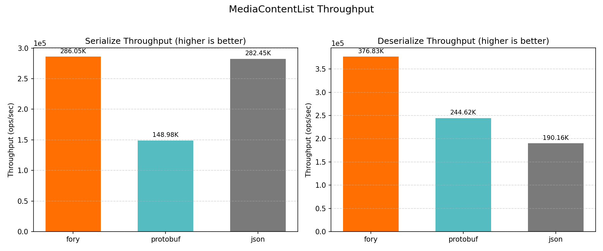
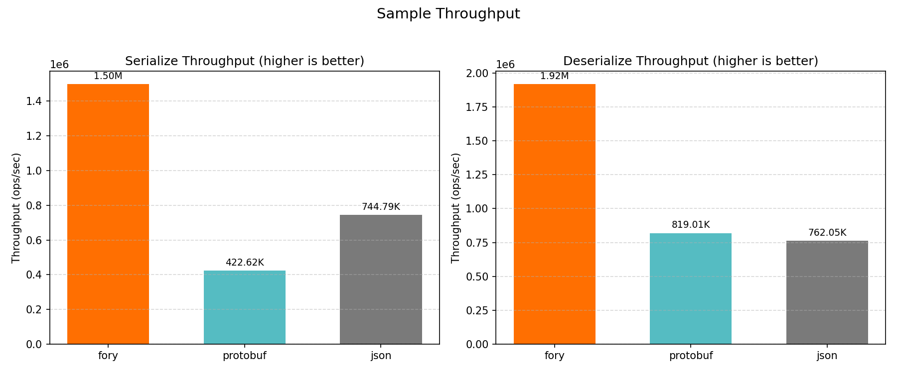
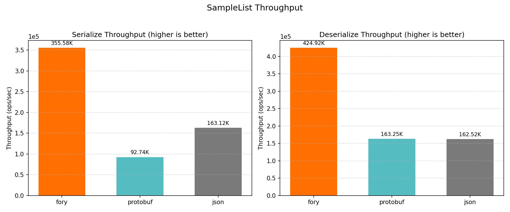
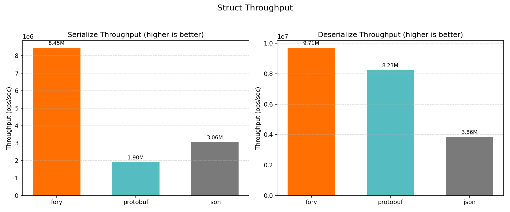
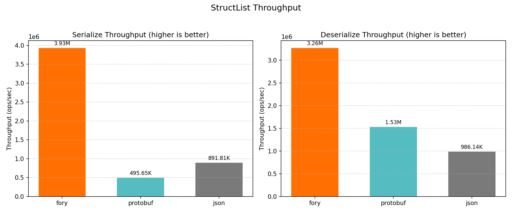

> **说明**：不同的序列化框架在不同场景下各有优势。性能测试结果仅供参考。
> 对于你的具体使用场景，请使用合适的配置和工作负载自行进行基准测试。

## Java 性能测试

Java 性能测试部分使用 `docs/benchmarks/java` 中的当前基准套件，对 Fory 与常见 Java 序列化框架进行对比。

**序列化吞吐**：

**反序列化吞吐**：

**零拷贝序列化吞吐**：

**零拷贝反序列化吞吐**：

**重要说明**：Fory 的运行时代码生成依赖充分预热后才能进行准确的性能测量。

更多性能测试说明、原始数据和完整 Java benchmark README 请参见 [Java Benchmarks](https://github.com/apache/fory/tree/main/docs/benchmarks/java)。

## Python 性能测试

Fory Python 在对象和列表两类工作负载下，相比 `pickle` 和 Protobuf 展现出较强的性能表现。

性能测试配置、原始结果以及复现方式请参见 [Python 性能测试报告](../benchmarks/python/README.md)。

## Rust 性能测试

Fory Rust 相比其他 Rust 序列化框架展现出有竞争力的性能。

注意：结果取决于硬件、数据集和实现版本。关于如何自行运行性能测试，请参见 Rust 指南：https://github.com/apache/fory/blob/main/benchmarks/rust_benchmark/README.md

## C++ 性能测试

Fory C++ 相比 Protobuf C++ 序列化框架展现出有竞争力的性能。

## Go 性能测试

Fory Go 在单对象和列表两类工作负载下，相比 Protobuf 和 Msgpack 展现出较强的性能表现。

注意：结果取决于硬件、数据集和实现版本。详细信息请参见 Go 性能测试报告：https://fory.apache.org/docs/benchmarks/go/

## C\# 性能测试

Fory C\# 在强类型对象的序列化和反序列化工作负载下，相比 Protobuf 和 Msgpack 展现出较强的性能表现。

注意：结果取决于硬件和运行时版本。详细信息请参见 C\# 性能测试报告：https://fory.apache.org/docs/benchmarks/csharp/

## Swift 性能测试

Fory Swift 在标量对象和列表两类工作负载下，相比 Protobuf 和 Msgpack 展现出较强的性能表现。

注意：结果取决于硬件和运行时版本。详细信息请参见 Swift 性能测试报告：https://fory.apache.org/docs/benchmarks/swift/

## JavaScript 性能测试

该基准在具有代表性的 JavaScript/Node.js 工作负载下，对 Apache Fory、Protocol Buffers 与 JSON 进行对比。

性能测试配置、硬件/运行时信息及完整报告请参见 [JavaScript 性能测试报告](../benchmarks/javascript/README.md)。

**总吞吐量**：

**吞吐结果（ops/sec）**：

| 数据类型         | 操作        | fory TPS  | protobuf TPS | json TPS  | 最快    |
| ---------------- | ----------- | --------- | ------------ | --------- | ------- |
| Struct           | Serialize   | 8,453,950 | 1,903,706    | 3,058,232 | fory    |
| Struct           | Deserialize | 9,705,287 | 8,233,664    | 3,860,538 | fory    |
| Sample           | Serialize   | 1,498,391 | 422,620      | 744,790   | fory    |
| Sample           | Deserialize | 1,918,162 | 819,010      | 762,048   | fory    |
| MediaContent     | Serialize   | 1,293,157 | 729,497      | 1,299,908 | json    |
| MediaContent     | Deserialize | 1,638,086 | 1,209,140    | 921,191   | fory    |
| StructList       | Serialize   | 3,928,325 | 495,648      | 891,810   | fory    |
| StructList       | Deserialize | 3,264,827 | 1,529,744    | 986,144   | fory    |
| SampleList       | Serialize   | 355,581   | 92,741       | 163,120   | fory    |
| SampleList       | Deserialize | 424,916   | 163,253      | 162,520   | fory    |
| MediaContentList | Serialize   | 286,053   | 148,977      | 282,445   | fory    |
| MediaContentList | Deserialize | 376,826   | 244,622      | 190,155   | fory    |

**序列化数据大小（字节）**：

| 数据类型         | fory | protobuf | json |
| ---------------- | ---- | -------- | ---- |
| Struct           | 58   | 61       | 103  |
| Sample           | 446  | 377      | 724  |
| MediaContent     | 391  | 307      | 596  |
| StructList       | 184  | 315      | 537  |
| SampleList       | 1980 | 1900     | 3642 |
| MediaContentList | 1665 | 1550     | 3009 |

**各工作负载图表**：

### MediaContent

### MediaContentList

### Sample

### SampleList

### Struct

### StructList

## Dart 性能测试

该基准在具有代表性的 Dart 工作负载下，对 Apache Fory 与 Protocol Buffers 进行对比。

性能测试配置、硬件/运行时信息及完整报告请参见 [Dart 性能测试报告](../benchmarks/dart/README.md)。

**总吞吐量**：

**吞吐结果（ops/sec）**：

| 数据类型         | 操作        |  Fory TPS | Protobuf TPS | 最快         |
| ---------------- | ----------- | --------: | -----------: | ------------ |
| Struct           | Serialize   | 3,989,432 |    1,884,653 | fory (2.12x) |
| Struct           | Deserialize | 5,828,197 |    4,199,680 | fory (1.39x) |
| Sample           | Serialize   | 1,649,722 |      500,167 | fory (3.30x) |
| Sample           | Deserialize | 2,060,113 |      785,109 | fory (2.62x) |
| MediaContent     | Serialize   |   800,876 |      391,235 | fory (2.05x) |
| MediaContent     | Deserialize | 1,315,115 |      683,533 | fory (1.92x) |
| StructList       | Serialize   | 1,456,396 |      367,506 | fory (3.96x) |
| StructList       | Deserialize | 1,921,006 |      645,958 | fory (2.97x) |
| SampleList       | Serialize   |   411,144 |       48,508 | fory (8.48x) |
| SampleList       | Deserialize |   464,273 |      103,558 | fory (4.48x) |
| MediaContentList | Serialize   |   186,870 |       77,029 | fory (2.43x) |
| MediaContentList | Deserialize |   330,293 |      128,215 | fory (2.58x) |

**序列化数据大小（字节）**：

| 数据类型         | Fory | Protobuf |
| ---------------- | ---: | -------: |
| Struct           |   58 |       61 |
| Sample           |  446 |      377 |
| MediaContent     |  365 |      307 |
| StructList       |  184 |      315 |
| SampleList       | 1980 |     1900 |
| MediaContentList | 1535 |     1550 |

**各工作负载图表**：

### Struct

### Sample

### MediaContent

### StructList

### SampleList

### MediaContentList

