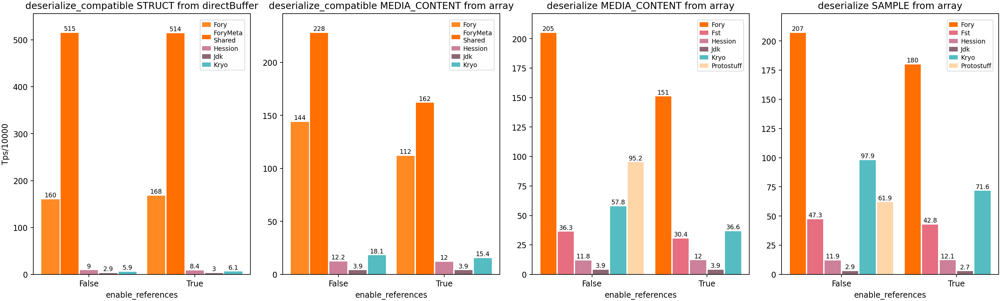

> **说明**：不同的序列化框架在不同场景下各有优势。性能测试结果仅供参考。
> 对于你的具体使用场景，请使用合适的配置和工作负载自行进行基准测试。

## Java 性能测试

Java 性能测试部分使用 `docs/benchmarks/java` 中的当前基准套件，对 Fory 与常见 Java 序列化框架进行对比。

**序列化吞吐**：

**反序列化吞吐**：

**零拷贝序列化吞吐**：

**零拷贝反序列化吞吐**：

**重要说明**：Fory 的运行时代码生成依赖充分预热后才能进行准确的性能测量。

更多性能测试说明、原始数据和完整 Java benchmark README 请参见 [Java Benchmarks](https://github.com/apache/fory/tree/main/docs/benchmarks/java)。

## Rust 性能测试

Fory Rust 相比其他 Rust 序列化框架展现出有竞争力的性能。

注意：结果取决于硬件、数据集和实现版本。关于如何自行运行性能测试，请参见 Rust 指南：https://github.com/apache/fory/blob/main/benchmarks/rust_benchmark/README.md

## C++ 性能测试

Fory C++ 相比 Protobuf C++ 序列化框架展现出有竞争力的性能。

## Go 性能测试

Fory Go 在单对象和列表两类工作负载下，相比 Protobuf 和 Msgpack 展现出较强的性能表现。

注意：结果取决于硬件、数据集和实现版本。详细信息请参见 Go 性能测试报告：https://fory.apache.org/docs/benchmarks/go/

## C\# 性能测试

Fory C\# 在强类型对象的序列化和反序列化工作负载下，相比 Protobuf 和 Msgpack 展现出较强的性能表现。

注意：结果取决于硬件和运行时版本。详细信息请参见 C\# 性能测试报告：https://fory.apache.org/docs/benchmarks/csharp/

## Swift 性能测试

Fory Swift 在标量对象和列表两类工作负载下，相比 Protobuf 和 Msgpack 展现出较强的性能表现。

注意：结果取决于硬件和运行时版本。详细信息请参见 Swift 性能测试报告：https://fory.apache.org/docs/benchmarks/swift/

## JavaScript 性能测试

该柱状图使用的数据包含一个具有多种字段类型的复杂对象，JSON 数据大小为 3KB。

性能测试代码请参见 [benchmarks](https://github.com/apache/fory/blob/main/javascript/benchmark/index.js)。
