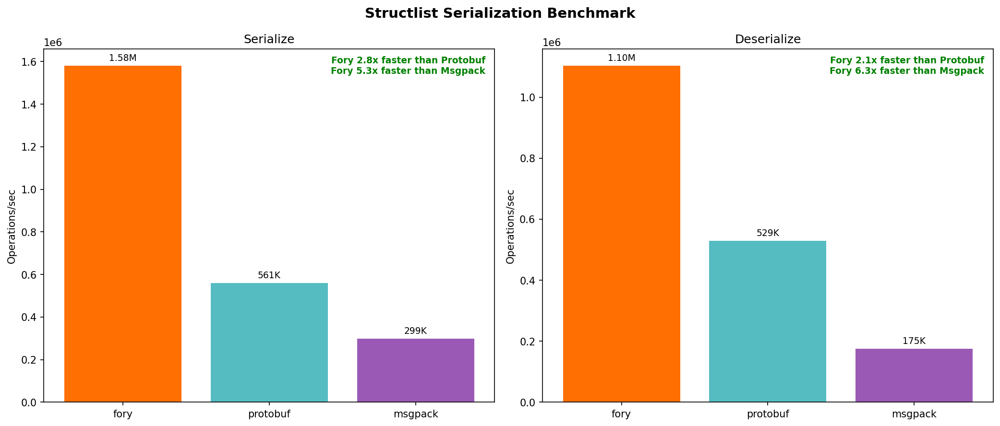
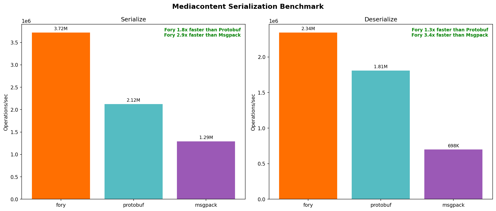

# Go 序列化基准报告

生成时间：2026-02-06 11:50:36

## 系统信息

- **操作系统**: Darwin 24.6.0
- **架构**: arm64
- **Python**: 3.9.6

## 性能摘要

| 数据类型 | 操作 | Fory (ops/s) | Protobuf (ops/s) | Msgpack (ops/s) | Fory vs PB | Fory vs MP |
|---------|------|--------------|------------------|-----------------|------------|------------|
| Struct | 序列化 | 15.16M | 10.23M | 5.41M | 1.48x | 2.80x |
| Struct | 反序列化 | 12.10M | 11.01M | 3.23M | 1.10x | 3.75x |
| Structlist | 序列化 | 1.58M | 561K | 299K | 2.82x | 5.28x |
| Structlist | 反序列化 | 1.10M | 529K | 175K | 2.09x | 6.30x |
| Sample | 序列化 | 7.28M | 2.72M | 670K | 2.68x | 10.87x |
| Sample | 反序列化 | 3.79M | 2.37M | 376K | 1.60x | 10.09x |
| Samplelist | 序列化 | 510K | 141K | 38K | 3.61x | 13.34x |
| Samplelist | 反序列化 | 236K | 107K | 19K | 2.20x | 12.66x |
| Mediacontent | 序列化 | 3.72M | 2.12M | 1.29M | 1.75x | 2.88x |
| Mediacontent | 反序列化 | 2.34M | 1.81M | 698K | 1.30x | 3.35x |
| Mediacontentlist | 序列化 | 268K | 110K | 72K | 2.44x | 3.72x |
| Mediacontentlist | 反序列化 | 138K | 87K | 36K | 1.58x | 3.86x |

## 详细耗时（ns/op）

| 数据类型 | 操作 | Fory | Protobuf | Msgpack |
|---------|------|------|----------|---------|
| Struct | 序列化 | 66.0 | 97.8 | 184.9 |
| Struct | 反序列化 | 82.7 | 90.9 | 309.6 |
| Structlist | 序列化 | 632.8 | 1783.0 | 3340.0 |
| Structlist | 反序列化 | 906.4 | 1891.0 | 5709.0 |
| Sample | 序列化 | 137.3 | 367.3 | 1492.0 |
| Sample | 反序列化 | 263.6 | 422.2 | 2661.0 |
| Samplelist | 序列化 | 1962.0 | 7087.0 | 26169.0 |
| Samplelist | 反序列化 | 4234.0 | 9321.0 | 53615.0 |
| Mediacontent | 序列化 | 268.8 | 471.1 | 773.7 |
| Mediacontent | 反序列化 | 426.9 | 553.1 | 1432.0 |
| Mediacontentlist | 序列化 | 3736.0 | 9107.0 | 13911.0 |
| Mediacontentlist | 反序列化 | 7247.0 | 11435.0 | 27975.0 |

### 序列化后数据大小（字节）

| 数据类型 | Fory | Protobuf | Msgpack |
|---------|------|----------|---------|
| Struct | 58 | 61 | 57 |
| Sample | 446 | 375 | 524 |
| MediaContent | 342 | 301 | 400 |
| StructList | 560 | 1260 | 1146 |
| SampleList | 7600 | 7560 | 10486 |
| MediaContentList | 5776 | 6080 | 8006 |

## 性能图表

### 综合概览

### Struct

### Structlist

### Sample

### Samplelist

### Mediacontent

### Mediacontentlist

