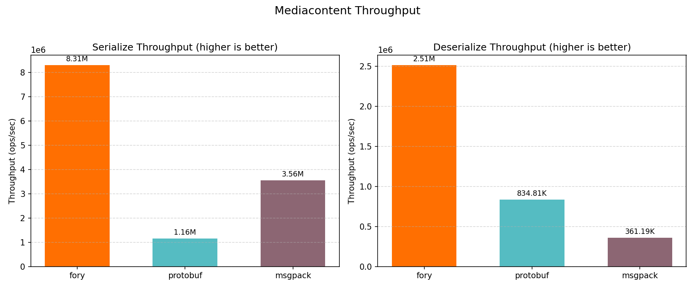
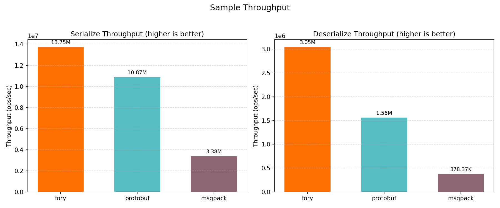
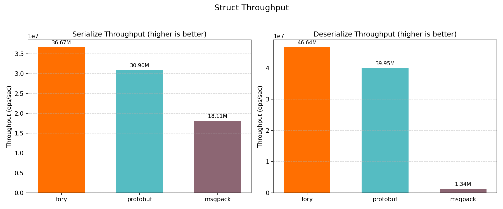

# C++ Benchmark Performance Report

_Generated on 2026-02-06 20:01:02_

## How to Generate This Report

```bash
cd benchmarks/cpp/build
./fory_benchmark --benchmark_format=json --benchmark_out=benchmark_results.json
cd ..
python benchmark_report.py --json-file build/benchmark_results.json --output-dir report
```

## Hardware & OS Info

| Key                        | Value                     |
| -------------------------- | ------------------------- |
| OS                         | Darwin 24.6.0             |
| Machine                    | arm64                     |
| Processor                  | arm                       |
| CPU Cores (Physical)       | 12                        |
| CPU Cores (Logical)        | 12                        |
| Total RAM (GB)             | 48.0                      |
| Benchmark Date             | 2026-02-06T20:00:20+08:00 |
| CPU Cores (from benchmark) | 12                        |

## Benchmark Plots

### Mediacontent

<p align="center">

</p>

### Mediacontentlist

<p align="center">

</p>

### Sample

<p align="center">

</p>

### Samplelist

<p align="center">

</p>

### Struct

<p align="center">

</p>

### Structlist

<p align="center">

</p>

### Throughput

<p align="center">

</p>

## Benchmark Results

### Timing Results (nanoseconds)

| Datatype         | Operation   | Fory (ns) | Protobuf (ns) | Faster       |
| ---------------- | ----------- | --------- | ------------- | ------------ |
| Mediacontent     | Serialize   | 512.0     | 1990.9        | Fory (3.9x)  |
| Mediacontent     | Deserialize | 1674.1    | 2516.6        | Fory (1.5x)  |
| Mediacontentlist | Serialize   | 2261.0    | 10804.2       | Fory (4.8x)  |
| Mediacontentlist | Deserialize | 6943.5    | 13375.9       | Fory (1.9x)  |
| Sample           | Serialize   | 241.7     | 309.4         | Fory (1.3x)  |
| Sample           | Deserialize | 1055.8    | 1361.5        | Fory (1.3x)  |
| Samplelist       | Serialize   | 963.2     | 11716.7       | Fory (12.2x) |
| Samplelist       | Deserialize | 5295.9    | 12162.2       | Fory (2.3x)  |
| Struct           | Serialize   | 117.1     | 169.6         | Fory (1.4x)  |
| Struct           | Deserialize | 138.6     | 156.2         | Fory (1.1x)  |
| Structlist       | Serialize   | 308.4     | 1299.4        | Fory (4.2x)  |
| Structlist       | Deserialize | 706.2     | 1188.0        | Fory (1.7x)  |

### Throughput Results (ops/sec)

| Datatype         | Operation   | Fory TPS  | Protobuf TPS | Faster       |
| ---------------- | ----------- | --------- | ------------ | ------------ |
| Mediacontent     | Serialize   | 1,952,940 | 502,295      | Fory (3.9x)  |
| Mediacontent     | Deserialize | 597,343   | 397,356      | Fory (1.5x)  |
| Mediacontentlist | Serialize   | 442,277   | 92,557       | Fory (4.8x)  |
| Mediacontentlist | Deserialize | 144,020   | 74,761       | Fory (1.9x)  |
| Sample           | Serialize   | 4,138,037 | 3,232,073    | Fory (1.3x)  |
| Sample           | Deserialize | 947,188   | 734,472      | Fory (1.3x)  |
| Samplelist       | Serialize   | 1,038,236 | 85,348       | Fory (12.2x) |
| Samplelist       | Deserialize | 188,825   | 82,222       | Fory (2.3x)  |
| Struct           | Serialize   | 8,542,313 | 5,896,325    | Fory (1.4x)  |
| Struct           | Deserialize | 7,217,541 | 6,403,969    | Fory (1.1x)  |
| Structlist       | Serialize   | 3,242,105 | 769,562      | Fory (4.2x)  |
| Structlist       | Deserialize | 1,416,005 | 841,739      | Fory (1.7x)  |

### Serialized Data Sizes (bytes)

| Datatype         | Fory | Protobuf |
| ---------------- | ---- | -------- |
| Struct           | 58   | 61       |
| Sample           | 446  | 375      |
| MediaContent     | 365  | 301      |
| StructList       | 184  | 315      |
| SampleList       | 1980 | 1890     |
| MediaContentList | 1535 | 1520     |
